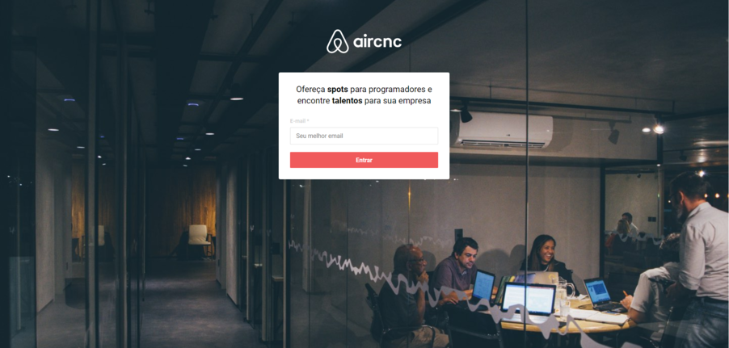

# AirCnC (Air Code & Coffe)

AirCnc is a platform that publishes spots of registered companies. Developers submit a reservation request, so the company accepts or declines the request, all in real time using socket.io

### Demo



## :rocket: Technologies

This project was developed with the following technologies:

## Backend

- Nodejs
- Express
- CORS
- Axios
- websocket
- Socket.io
- Mongoose
- MongoDB Atlas
- MongoDB Compass
- Multer
- VS Code with EditorConfig and ESLint

## Frontend

- ReactJS
- Create React app
- Axios
- React Router Dom
- Socket.io
- VS Code with EditorConfig and ESLint

## Mobile

- Expo
- React Native
- React Native Async Storage
- Axios
- Socket.io
- React Navigation
- React gesture-handler
- React-native-reanimated
- VS Code with EditorConfig and ESLint

## :information_source: How To Use

```bash
# Clone this repository
$ git clone https://github.com/thyagoaraujo/aircnc.git

# Go into the repository
$ cd aircnc

# Install dependencies
$ yarn install

# Run the app
$ cd backend
$ yarn dev
$ cd frontend
$ yarn start

# Run the app mobile
$ cd mobile
$ yarn start
$ run expo on smartphone

```

## :memo: License

This project is under the MIT license. See the [LICENSE](https://github.com/thyagoaraujo/aircnc/blob/master/LICENSE.md) for more information.

---

Made with ♥ by Thyago Araujo :wave: [Get in touch!](https://www.linkedin.com/in/thyagosantosaraujo/)
